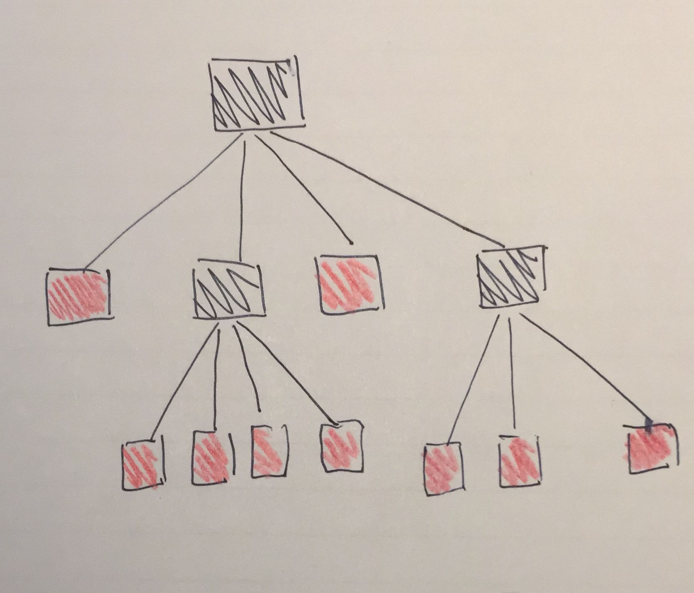

# Rush Hour
Welcome to the Rush Hour game, designed by the No-Rush team!

## Summary
Using this program you can play the Rush Hour game on your own device. The goal is to get the red vehicle to the exit as soon as possible. The goal of this project is to implement several algorithms that can solve the puzzles on their own. This is a challenging task as boards will grow in size and so do the possible solutions. This means that it is our task to find the fastest working algorithm, which can be running for hours before a solution is found. With this project we aim to provide the user with those algorithms and enable them to compare the outputs.

(Left: Rush Hour gameboard. Right: Visualisation of our program, finding a solution).

## Requirements
This codebase is dependend on the following requirements that can be installed as follows:
- Run requirements.txt using `pip3 install -r requirements.txt`

## Working
Run the programm using the preferred command:
`python3 main.py board algorithm [-N N] --no-gif`

- In which board can be any of the boards under data/gameboards, for example: 'Rushhour9x9_4'
- Algorithm can be one of 'cl' (command line), 'rl' (random solutions), 'r' (random - cuts off longer solutions), 'br' (breadth first), 'e' (efficient search), 'rbr' (combined Breadth/random) or 'a' (A* algorithm).
- (optional) In which N lets random algorithm run N times & chooses best solution, for example: '-N 5'
- In which ' --no-gif' is highly suggested. The program automatically generates a GIF of the found solutions, but this takes a lot of time for longer solutions. This command turns off GIF generation.

## Algorithms
In the programm there are several algorithms that can be used as input.
- **Random long** (All the possible moves of a board are saved to a dictionary, and one is picked randomly. This is repeated untill the puzzle is completed).
- **Random** (Works the same as Random long when it is run one time. But when the N parameter is added, it keeps track of the fastest solution thus far. Any time it exceeds that number of moves, it stops and goes to the next run).
- **Breadth first** (Each run gives the best possible solution to solve the puzzle. Walks through the tree of possible states breadth first from left to right. It is slow and takes up a lot of memory).
- **Efficient search** (Uses a heuristic - number of valid moves of a board - and a filter value - percentage of boards that is thrown away based on the heuristic).
- **Combined Breadth/random** (Uses breadth first algorithm untill the number of states exceeds a certain value. From this point random search is used).
- **A*** (The best state from a selection is chosen using one of two heuristics (amount of cars blocking the red car / difference between current board and a board in a solved state (generated using random)). This state is then replaced by its children. From this new selection again the best state is chosen. The process repeats till a solution is found.)

## Structure
The structure of our directory:

- /code: all the project's code
    - /code/algorithms: all the used algorithms
    - /code/classes: the several classes used in the project
    - /code/visualisation: contains the visualisation code
    - /code/analysis: contains the code to analyse the different algorithms
- /data: contains the gameboards that can be used and the optimal solutions we have found so far
- /presentation: contains several image outputs used in the presentation

## Automatic results
By running the auto script of an algorithm, the algorithm will automatically be run for a certain amount of time and the solution lengths will be saved to a file. The random algorithm will be filtered for the best result. The algorithms can now be compared. Run:
- auto_breadth_first.py
- auto_a_star.py
- br_vs_astar.py (Breadth first and a* algorithms are executed and the results are compared within one script).
- tune_breadth_random.py
- tune_efficient_search.py (By running the the tune script of efficient_search.py, you find out what the best filter value is per board).
- auto_random_run.py

## No Rush Team
- Lance van Duin, [@Lancelot81](https://www.github.com/Lancelot81)
- Tjibbe Valkenburg, [@tjibbev](https://github.com/tjibbev)
- Doena van den Hoven, [@DoenaH](https://github.com/DoenaH)

